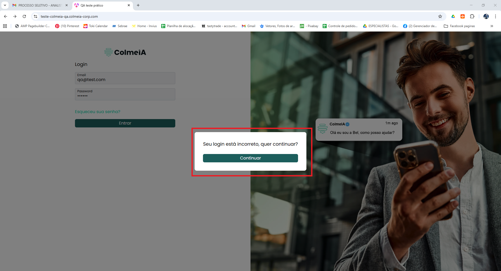
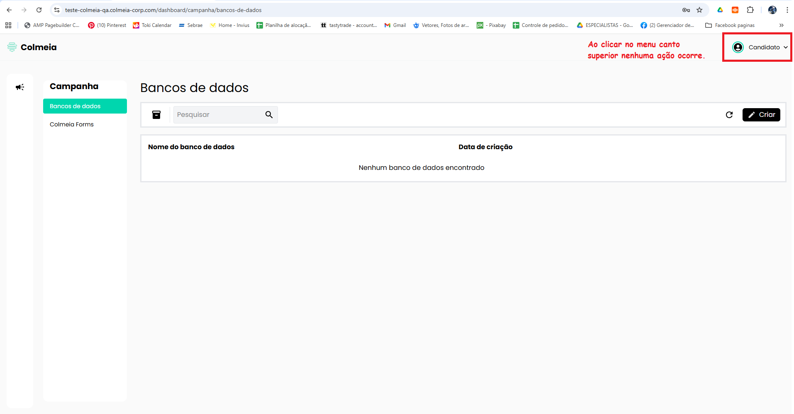
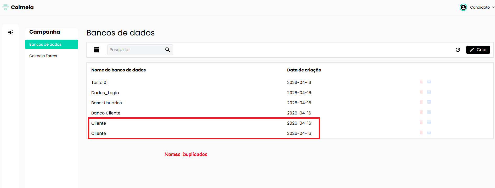

# 🐞 Relatório de Bugs

## 🔐 Login

BUG 1 - Login com credenciais válidas retorna erro

Título: Sistema retorna erro mesmo com credenciais válidas

Passos:
1. Inserir email válido (qa@test.com)
2. Inserir senha válida (123456)
3. Clicar em "Entrar"

Resultado esperado:
Usuário deve ser autenticado e redirecionado ao dashboard.

Resultado encontrado:
Sistema exibe mensagem:
"Seu login está incorreto, quer continuar?"

Após clicar em "Continuar", o usuário é redirecionado ao dashboard

📸 Evidência:

Prioridade: Crítica
___________________________________________________________________________

BUG 2 — Link "Esqueceu sua senha?" não funcional

Título: Link "Esqueceu sua senha?" não realiza nenhuma ação

Passos:
1. Clicar no link "Esqueceu sua senha?"

Resultado esperado:
Redirecionar para fluxo de recuperação de senha

Resultado encontrado:
Nenhuma ação ocorre

Prioridade: Crítica
____________________________________________________________________________

Sugestão / Melhoria:
Não há opção de cadastro de usuário na tela de login, o que pode limitar novos acessos ao sistema.

____________________________________________________________________________

## 📊 Dashboard

Bug 3 - Menu do Usuário (MENU SUPERIOR)

Título: Abertura do menu do usuário não realiza nenhuma ação.

Passos:
1. Clicar no Menu canto superior 

Resultado Esperado:
Sistema deve exibir opções do usuário (ex: perfil, logout)

Resultado encontrado:
Nenhuma ação ocorre, menu não funcional.

📸 Evidência:

Prioridade: Média

____________________________________________________________________________

## 🗄️ Banco de Dados

BUG 4 — Dados somem ao atualizar

Título: Dados dos bancos desaparecem ao atualizar a página

Cenário:
Usuário atualiza a lista de bancos após criação

Passos para reproduzir:
1. Criar um ou mais bancos de dados
2. Clicar no botão de atualizar (refresh) 

Resultado esperado:
Lista deve permanecer com os bancos criados

Resultado encontrado:
Todos os bancos desaparecem da lista

Prioridade: Alta

___________________________________________________________________________

BUG  — Sistema permite nomes duplicados

Título: Sistema permite criação de bancos de dados com nomes duplicados

Cenário:
Criação de múltiplos bancos com o mesmo nome

Passos para reproduzir:
1. Criar um banco com determinado nome (Cliente)
2. Criar outro banco com o mesmo nome  (Cliente)

Resultado esperado:
Sistema deve impedir duplicidade ou exibir mensagem de erro

Resultado encontrado:
Sistema permite múltiplos bancos com nomes iguais

📸 Evidência:

Prioridade: Média

___________________________________________________________________________

BUG  — Arquivar remove permanentemente o banco

Título: Banco de dados arquivado não aparece na lista de arquivados

Cenário:
Usuário tenta arquivar um banco de dados

Passos para reproduzir:
1. Criar um banco de dados
2. Clicar no ícone de arquivar
3. Acessar a aba de arquivados

Resultado esperado:
Banco deve aparecer na lista de arquivados

Resultado atual:
Banco não aparece na lista e é removido permanentemente

Prioridade: Alta